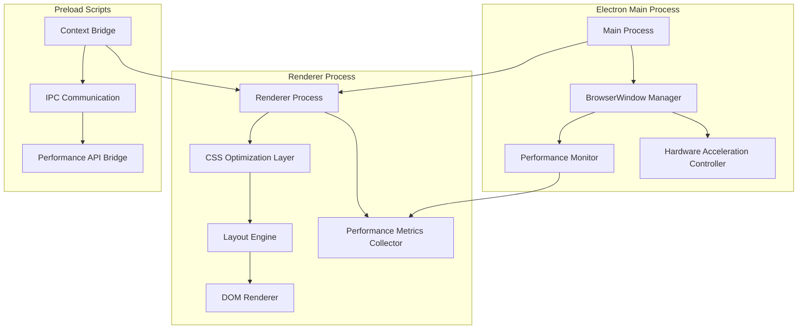
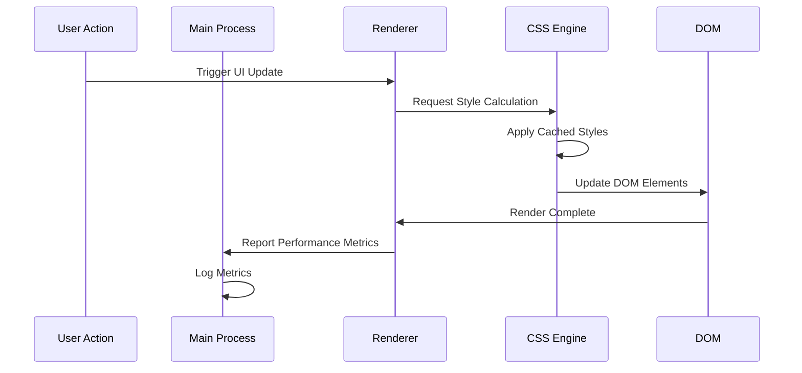

# Documento de Diseño: Optimización de Rendimiento en Electron

## Resumen

Este documento describe el diseño técnico para optimizar el rendimiento y solucionar los problemas de renderizado en la aplicación Electron de Pharma-Sync. La solución se enfoca en tres áreas principales: configuración optimizada de Electron, mejoras en el sistema de renderizado CSS, y implementación de monitoreo de rendimiento.

## Arquitectura

### Arquitectura General



### Flujo de Renderizado Optimizado



## Componentes y Interfaces

### 1. Electron Configuration Manager

**Responsabilidad**: Gestionar la configuración optimizada de Electron para máximo rendimiento.

**Interfaz**:
```typescript
interface ElectronConfigManager {
  initializeWindow(): BrowserWindow;
  configureWebPreferences(): WebPreferences;
  enableHardwareAcceleration(): void;
  setupSecuritySettings(): void;
}
```

**Configuraciones Clave**:
- `contextIsolation: true` para seguridad
- `nodeIntegration: false` para aislamiento
- `webSecurity: true` para protección
- Hardware acceleration habilitada por defecto
- Preload scripts para comunicación segura

### 2. CSS Optimization Engine

**Responsabilidad**: Optimizar la carga y aplicación de estilos CSS específicamente para Electron.

**Interfaz**:
```typescript
interface CSSOptimizationEngine {
  preloadCriticalCSS(): Promise<void>;
  applyCSSOptimizations(): void;
  enableElectronSpecificStyles(): void;
  cacheComputedStyles(): void;
}
```

**Optimizaciones**:
- Carga asíncrona de CSS no crítico
- Inlining de CSS crítico
- Eliminación de CSS no utilizado
- Compresión y minificación
- Cache de estilos computados

### 3. Layout Performance Monitor

**Responsabilidad**: Monitorear y optimizar el rendimiento del layout y renderizado.

**Interfaz**:
```typescript
interface LayoutPerformanceMonitor {
  measureRenderTime(): number;
  detectLayoutThrashing(): boolean;
  optimizeReflows(): void;
  reportMetrics(): PerformanceMetrics;
}

interface PerformanceMetrics {
  renderTime: number;
  memoryUsage: number;
  cpuUsage: number;
  layoutShifts: number;
}
```

### 4. Menu and Sidebar Renderer

**Responsabilidad**: Renderizar correctamente los menús y sidebar con optimizaciones específicas para Electron.

**Interfaz**:
```typescript
interface MenuSidebarRenderer {
  renderMenu(): void;
  renderSidebar(): void;
  applyResponsiveLayout(): void;
  handleWindowResize(): void;
}
```

**Características**:
- Renderizado virtual para elementos grandes
- Lazy loading de elementos no visibles
- Optimización de z-index y layering
- Responsive design específico para Electron

### 5. Resource Cache Manager

**Responsabilidad**: Gestionar el cache de recursos para mejorar tiempos de carga.

**Interfaz**:
```typescript
interface ResourceCacheManager {
  cacheStaticAssets(): void;
  preloadCriticalResources(): Promise<void>;
  clearUnusedCache(): void;
  optimizeImageLoading(): void;
}
```

## Modelos de Datos

### Performance Metrics Model

```typescript
interface PerformanceMetrics {
  timestamp: number;
  renderTime: number;
  memoryUsage: {
    used: number;
    total: number;
    percentage: number;
  };
  cpuUsage: number;
  layoutMetrics: {
    reflows: number;
    repaints: number;
    layoutShifts: number;
  };
  resourceMetrics: {
    cssLoadTime: number;
    jsLoadTime: number;
    imageLoadTime: number;
  };
}
```

### Configuration Model

```typescript
interface ElectronConfig {
  webPreferences: {
    contextIsolation: boolean;
    nodeIntegration: boolean;
    webSecurity: boolean;
    enableRemoteModule: boolean;
    preload: string;
  };
  performance: {
    hardwareAcceleration: boolean;
    backgroundThrottling: boolean;
    v8CacheOptions: string;
  };
  window: {
    width: number;
    height: number;
    minWidth: number;
    minHeight: number;
    webPreferences: WebPreferences;
  };
}
```

### CSS Optimization Config

```typescript
interface CSSOptimizationConfig {
  criticalCSS: {
    inline: boolean;
    extractAboveFold: boolean;
    minify: boolean;
  };
  nonCriticalCSS: {
    asyncLoad: boolean;
    defer: boolean;
    preload: boolean;
  };
  electronSpecific: {
    disableAnimations: boolean;
    optimizeForDesktop: boolean;
    enableGPUAcceleration: boolean;
  };
}
```

## Propiedades de Corrección

*Una propiedad es una característica o comportamiento que debe mantenerse verdadero a través de todas las ejecuciones válidas de un sistema - esencialmente, una declaración formal sobre lo que el sistema debe hacer. Las propiedades sirven como puente entre especificaciones legibles por humanos y garantías de corrección verificables por máquinas.*

### Propiedad 1: Consistencia de Layout y Renderizado
*Para cualquier* configuración de UI (menú, sidebar, formularios, tablas, modales), cuando se renderiza en Electron, todos los elementos deben posicionarse correctamente sin overlapping, misalignment, o problemas de z-index
**Valida: Requerimientos 1.1, 1.2, 1.4, 1.5, 3.2, 3.4**

### Propiedad 2: Tiempos de Respuesta del Sistema
*Para cualquier* acción del usuario (clicks, navegación, carga de páginas, aplicación de CSS), el tiempo de respuesta debe estar dentro de los límites especificados (100ms para feedback visual, 200ms para navegación, 300ms para CSS, 1s para renderizado inicial, 3s para inicio completo)
**Valida: Requerimientos 1.3, 2.1, 2.2, 2.3, 2.4**

### Propiedad 3: Uso Eficiente de Recursos
*Para cualquier* estado de la aplicación (idle, procesando datos, carga continua), el uso de CPU debe mantenerse bajo 15% en idle, la memoria bajo 200MB en idle, y no debe haber memory leaks durante ejecución prolongada
**Valida: Requerimientos 2.5, 6.1, 6.5**

### Propiedad 4: Renderizado Suave y Consistente
*Para cualquier* operación de renderizado (scrolling, animaciones, actualizaciones de UI), el framerate debe mantenerse a 60fps y la apariencia debe ser consistente con la versión web
**Valida: Requerimientos 3.3, 3.5**

### Propiedad 5: Compatibilidad Cross-Platform
*Para cualquier* funcionalidad JavaScript, estilos CSS, o breakpoints responsive, el comportamiento debe ser idéntico entre la versión web y Electron
**Valida: Requerimientos 4.2, 4.3, 4.4**

### Propiedad 6: Monitoreo y Diagnóstico Efectivo
*Para cualquier* problema de rendimiento o renderizado, el sistema de monitoreo debe capturar métricas detalladas, establecer baselines, generar alertas cuando se excedan thresholds, y trackear KPIs continuamente
**Valida: Requerimientos 5.1, 5.2, 5.3, 5.4, 5.5**

### Propiedad 7: Optimización de Recursos y Cache
*Para cualquier* asset (CSS, JavaScript, imágenes), el sistema debe implementar caching eficiente, paginación/virtualización para datasets grandes, y optimización específica para el entorno Electron
**Valida: Requerimientos 6.2, 6.3, 6.4**

### Propiedad 8: Configuración Optimizada de Electron
*Para cualquier* inicialización de la aplicación, el sistema debe aplicar optimizaciones específicas de Electron, habilitar aceleración de hardware cuando esté disponible, usar APIs nativas apropiadas, y mantener compatibilidad web
**Valida: Requerimientos 7.1, 7.2, 7.3, 7.4, 7.5**

## Manejo de Errores

### Estrategia de Manejo de Errores

1. **Graceful Degradation**: Si la aceleración de hardware falla, la aplicación debe continuar funcionando con renderizado por software
2. **Fallback Mechanisms**: Si los estilos optimizados fallan, debe haber fallback a estilos estándar
3. **Error Reporting**: Todos los errores de renderizado y rendimiento deben ser capturados y reportados
4. **Recovery Mechanisms**: La aplicación debe poder recuperarse de errores de renderizado sin requerir reinicio

### Tipos de Errores y Respuestas

```typescript
enum ErrorType {
  RENDERING_FAILURE = "rendering_failure",
  PERFORMANCE_DEGRADATION = "performance_degradation", 
  RESOURCE_LOADING_ERROR = "resource_loading_error",
  LAYOUT_CORRUPTION = "layout_corruption"
}

interface ErrorResponse {
  type: ErrorType;
  fallbackAction: () => void;
  reportError: (error: Error) => void;
  attemptRecovery: () => boolean;
}
```

## Estrategia de Testing

### Enfoque Dual de Testing

La estrategia de testing combina **unit tests** y **property-based tests** para cobertura comprehensiva:

- **Unit tests**: Verifican ejemplos específicos, casos edge, y condiciones de error
- **Property tests**: Verifican propiedades universales a través de todos los inputs
- Juntos proporcionan cobertura comprehensiva (unit tests capturan bugs concretos, property tests verifican corrección general)

### Configuración de Property-Based Testing

- **Biblioteca**: Para JavaScript/TypeScript, usar `fast-check` para property-based testing
- **Iteraciones mínimas**: 100 iteraciones por property test (debido a randomización)
- **Formato de tags**: Cada property test debe referenciar su propiedad del documento de diseño
- **Tag format**: **Feature: electron-performance-optimization, Property {number}: {property_text}**
- Cada propiedad de corrección DEBE ser implementada por UN SOLO property-based test

### Balance de Unit Testing

- Los unit tests son útiles para ejemplos específicos y casos edge
- Evitar escribir demasiados unit tests - los property-based tests manejan la cobertura de muchos inputs
- Los unit tests deben enfocarse en:
  - Ejemplos específicos que demuestran comportamiento correcto
  - Puntos de integración entre componentes  
  - Casos edge y condiciones de error
- Los property tests deben enfocarse en:
  - Propiedades universales que se mantienen para todos los inputs
  - Cobertura comprehensiva de inputs a través de randomización

### Testing de Rendimiento

- **Métricas de Baseline**: Establecer métricas baseline para comparación
- **Load Testing**: Simular cargas pesadas para verificar límites de rendimiento
- **Memory Profiling**: Monitorear uso de memoria durante testing prolongado
- **Visual Regression Testing**: Comparar screenshots entre versiones para detectar regresiones visuales

### Testing de Compatibilidad

- **Cross-Platform Testing**: Verificar comportamiento en diferentes sistemas operativos
- **Browser vs Electron Testing**: Comparar comportamiento entre navegador web y Electron
- **Version Compatibility**: Testing con diferentes versiones de Electron y Chromium